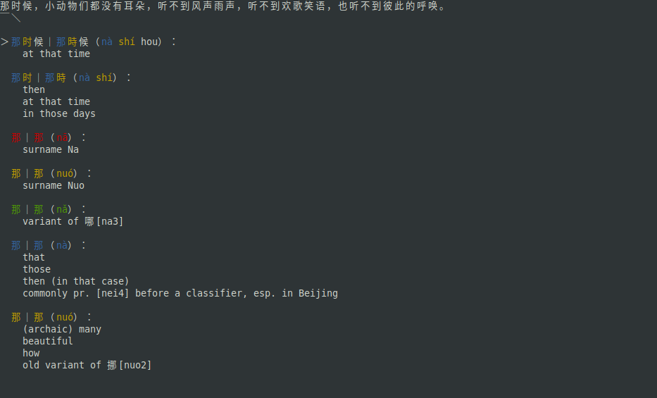

# CEDICT Curses

Interactive analzing of a Chinese sentence and looking up words in the CC-CEDCIT dictionary. With Pinyin, Zhuyin and tone colors.

## __Features__

* Read sentence from clipboard or command-line argument
* Show Pinyin or [Zhuyin](https://en.wikipedia.org/wiki/Bopomofo) with MDBG-style tone colours for readings
* Add words to [Anki](https://apps.ankiweb.net/) (using [Anki Connect](https://foosoft.net/projects/anki-connect/))
* Search/Open selected word in certain websites (See [keybinds](#usage))


  
## __Requirements__

* `curses`
* `cedict_utils`
* `dragonmapper`
* `pyperclip`
* `webbrowser`

The following command should do the trick:

```sh
python3 -m pip install cedict_utils dragonmapper pyperclip
```

(`curses` and `webbroser` should already be included with the python standard library)

## __Usage__

```sh
python3 cedict-curses.py [SENTENCE]

    SENTENCE - The initial sentence to load. Can be omitted.
```

Before starting, you'll have to download and extract [CC-CEDICT](https://www.mdbg.net/chinese/dictionary?page=cedict) into the folder of this program.


Inside the program you can use the following keys:

| Key       | Alt. Key   | Function 
| --------- | ---------- | --- 
| q         | ESCAPE     | Quit the program 
| SPACE     |            | Load sentence from clipboard 
| RIGHT     | l          | Move right in the sentence 
| LEFT      | h          | Move left in the sentence 
| DOWN      | j          | Select the next result 
| UP        | k          | Select the previous result 
| r         |            | Toggle between Pinyin and Zhuyin 
| a         | ENTER      | Add selected result to / show in Anki
| l         | F1         | Search selected result on [LINE Dict](https://dict.naver.com/linedict/zhendict/dict.html#/cnen/home)
| f         | F2         | Search selected result on [Forvo](https://forvo.com) (Simplified)
| Shift + f | SHIFT + F2 | Search selected result on [Forvo](https://forvo.com) (Traditional)
| g         | F3         | Search selected result on [the Chinese Grammar Wiki](https://resources.allsetlearning.com/chinese/grammar/Main_Page)
| i         | F4         | Search selected result on [iCIBA](https://www.iciba.com)
| m         | F5         | Search selected result on [MDBG](https://www.mdbg.net/chinese/dictionary)
| t         | F6         | Search selected result on [Moedict (萌典)](https://moedict.tw)


* _The F1,F2,... keys are roughly based on the Alt+1,Alt+2,... keybinds of the [Zhongwen Browser Addon](https://github.com/cschiller/zhongwen#readme), so I don't confuse myself too much._
* _Forvo differentiates between simplified and traditional versions of words, hence the two keybinds. Though note that you'll get a mix of Mainland and Taiwan (and other) pronounciations in either case..._

## __Anki__

### Setup

1. Install [Anki Connect](https://ankiweb.net/shared/info/2055492159) addon for Anki.
2. In `settings.py`, set the `DECK`, `CARD_TYPE` and `WORD_FIELD` variables according to your Anki setup.

### Usage

Press the `a` (or `ENTER`) key inside the program, the Anki word browser should open with the word selected. If something goes wrong, an Error should be shown at the bottom of the program.

## __Settings__

In the `settings.py` file are a few variables to set, see the corresponding comments for more info.

## __TODO__

* Overflow handling; If there are too many results or the sentence is too long, things go bad...
